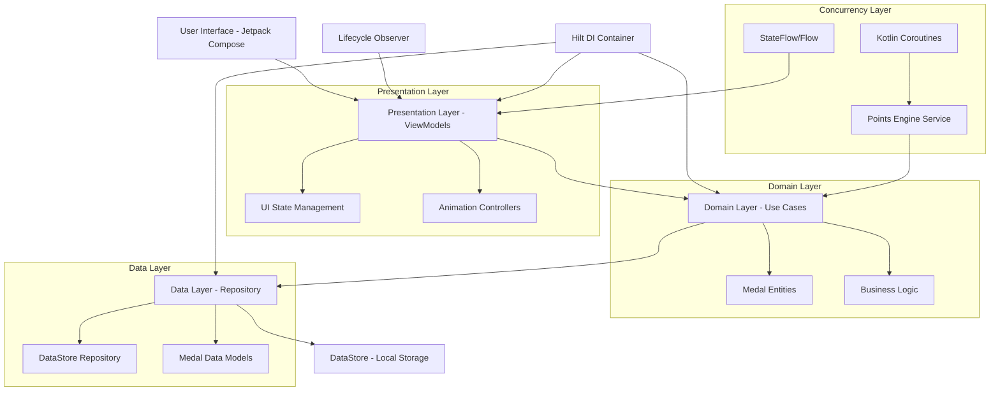
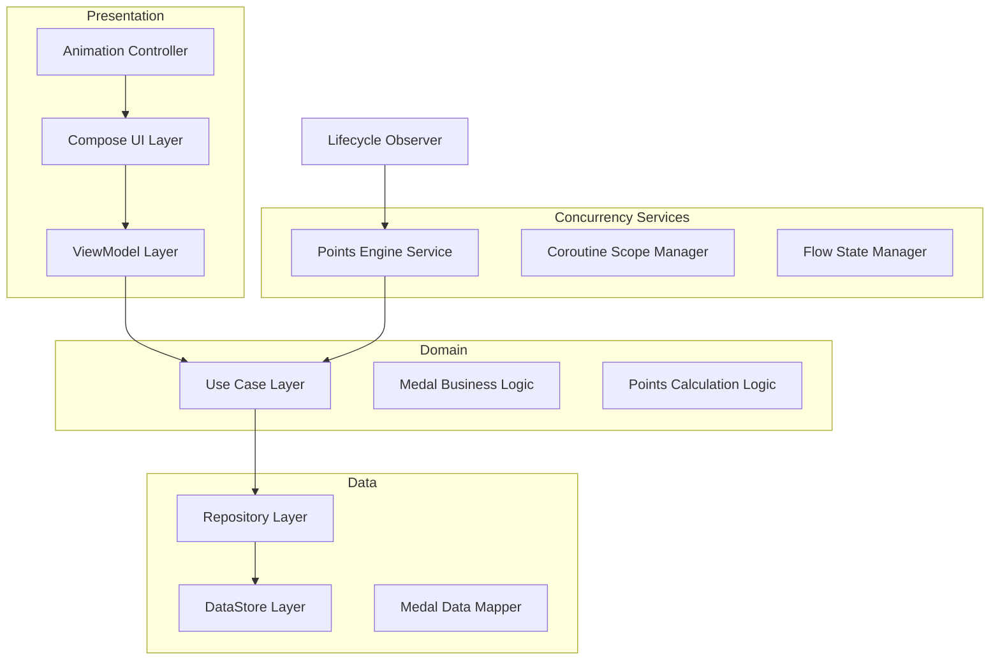
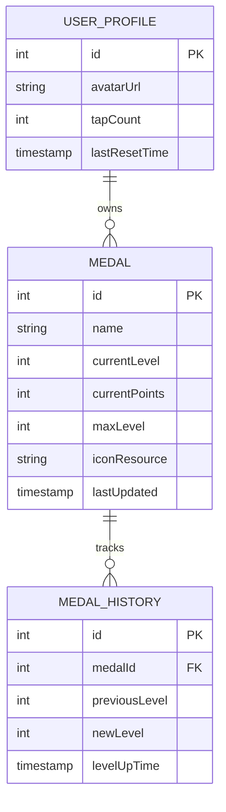

# Arquitectura Técnica - Vista de Perfil con Módulo de Medallas

## 1. Architecture design



## 2. Technology Description

- **Frontend**: Jetpack Compose + Material Design 3 + Kotlin
- **Architecture**: Clean Architecture + MVVM
- **Concurrency**: Kotlin Coroutines + Flow/StateFlow
- **Dependency Injection**: Hilt
- **Local Storage**: Android DataStore (Preferences)
- **Lifecycle Management**: Lifecycle-aware components + repeatOnLifecycle
- **Animations**: Compose Animation APIs + Custom particle systems

## 3. Route definitions

| Route | Purpose |
|-------|---------|
| /profile | Vista principal de perfil con navegación entre módulos |
| /profile/medals | Módulo de medallas con sistema de progreso automático |
| /profile/missions | Módulo de misiones (placeholder) |
| /profile/streaks | Módulo de rachas (placeholder) |
| /profile/album | Módulo de álbum (placeholder) |

## 4. API definitions

### 4.1 Core Domain Models

**Medal Entity**
```kotlin
data class Medal(
    val id: Int,
    val name: String,
    val currentLevel: Int,
    val currentPoints: Int,
    val maxLevel: Int,
    val iconResource: Int
)
```

**Medal Progress State**
```kotlin
data class MedalProgressState(
    val medals: List<Medal>,
    val isEngineRunning: Boolean,
    val lastLevelUpMedal: Medal? = null
)
```

### 4.2 Use Cases

**Get Medals Use Case**
```kotlin
interface GetMedalsUseCase {
    suspend operator fun invoke(): Flow<List<Medal>>
}
```

**Update Medal Points Use Case**
```kotlin
interface UpdateMedalPointsUseCase {
    suspend operator fun invoke(medalId: Int, points: Int): Medal?
}
```

**Reset All Progress Use Case**
```kotlin
interface ResetAllProgressUseCase {
    suspend operator fun invoke()
}
```

### 4.3 Repository Interface

**Medal Repository**
```kotlin
interface MedalRepository {
    suspend fun getMedals(): Flow<List<Medal>>
    suspend fun updateMedal(medal: Medal)
    suspend fun resetAllMedals()
    suspend fun initializeDefaultMedals()
}
```

## 5. Server architecture diagram



## 6. Data model

### 6.1 Data model definition



### 6.2 Data Definition Language

**DataStore Preferences Schema**
```kotlin
// Medal data structure stored in DataStore
object MedalPreferences {
    val MEDAL_DATA_KEY = stringPreferencesKey("medal_data")
    val ENGINE_STATE_KEY = booleanPreferencesKey("engine_running")
    val LAST_UPDATE_KEY = longPreferencesKey("last_update_timestamp")
    val AVATAR_TAP_COUNT_KEY = intPreferencesKey("avatar_tap_count")
    val LAST_TAP_TIME_KEY = longPreferencesKey("last_tap_time")
}

// Default medal initialization
val DEFAULT_MEDALS = listOf(
    Medal(1, "Explorador", 1, 0, 10, R.drawable.ic_explorer),
    Medal(2, "Guerrero", 1, 0, 8, R.drawable.ic_warrior),
    Medal(3, "Sabio", 1, 0, 12, R.drawable.ic_sage),
    Medal(4, "Artista", 1, 0, 7, R.drawable.ic_artist),
    Medal(5, "Atleta", 1, 0, 9, R.drawable.ic_athlete),
    Medal(6, "Constructor", 1, 0, 11, R.drawable.ic_builder),
    Medal(7, "Líder", 1, 0, 6, R.drawable.ic_leader),
    Medal(8, "Innovador", 1, 0, 10, R.drawable.ic_innovator),
    Medal(9, "Guardián", 1, 0, 8, R.drawable.ic_guardian),
    Medal(10, "Maestro", 1, 0, 15, R.drawable.ic_master)
)
```

**Points Engine Configuration**
```kotlin
object EngineConfig {
    const val POINTS_PER_LEVEL = 100
    const val MIN_POINTS_INCREMENT = 1
    const val MAX_POINTS_INCREMENT = 5
    const val UPDATE_INTERVAL_MS = 2000L
    const val RESET_TAP_THRESHOLD = 5
    const val TAP_RESET_TIMEOUT_MS = 3000L
}
```

**Hilt Module Configuration**
```kotlin
@Module
@InstallIn(SingletonComponent::class)
object AppModule {
    
    @Provides
    @Singleton
    fun provideDataStore(@ApplicationContext context: Context): DataStore<Preferences> {
        return PreferenceDataStoreFactory.create(
            produceFile = { context.preferencesDataStoreFile("medal_preferences") }
        )
    }
    
    @Provides
    @Singleton
    fun provideMedalRepository(dataStore: DataStore<Preferences>): MedalRepository {
        return MedalRepositoryImpl(dataStore)
    }
    
    @Provides
    fun provideGetMedalsUseCase(repository: MedalRepository): GetMedalsUseCase {
        return GetMedalsUseCaseImpl(repository)
    }
}
```