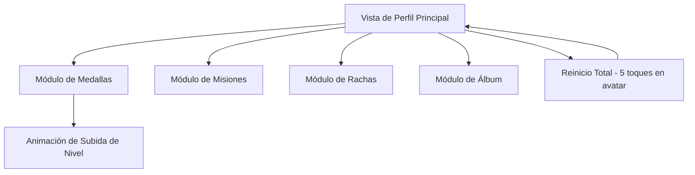

# Vista de Perfil con Módulo de Medallas - Documento de Requerimientos del Producto

## 1. Product Overview

Aplicación Android que presenta una vista de perfil de usuario gamificada con un sistema de medallas progresivo que incrementa automáticamente mediante procesos concurrentes, diseñada para mantener el engagement del usuario a través de logros visuales y animaciones atractivas.

El producto resuelve la necesidad de crear experiencias de usuario gamificadas que mantengan el progreso persistente y proporcionen retroalimentación visual inmediata cuando se alcanzan hitos, dirigido a desarrolladores que buscan implementar sistemas de logros robustos en aplicaciones móviles.

## 2. Core Features

### 2.1 User Roles

No se requiere distinción de roles de usuario para este producto. Todos los usuarios tienen acceso completo a la funcionalidad de la aplicación.

### 2.2 Feature Module

Nuestra aplicación de vista de perfil consiste en las siguientes páginas principales:

1. **Vista de Perfil Principal**: avatar de usuario, información básica, navegación entre módulos
2. **Módulo de Medallas**: sistema de 10 medallas con progreso automático y animaciones
3. **Módulos Placeholder**: secciones de Misiones, Rachas y Álbum como placeholders

### 2.3 Page Details

| Page Name | Module Name | Feature description |
|-----------|-------------|---------------------|
| Vista de Perfil Principal | Avatar de Usuario | Mostrar imagen de perfil, detectar 5 toques consecutivos para reinicio total del progreso |
| Vista de Perfil Principal | Navegación de Módulos | Pestañas o botones para acceder a Medallas, Misiones, Rachas y Álbum |
| Módulo de Medallas | Sistema de Medallas | Mostrar 10 medallas con nivel actual (LVL 1-10), puntos acumulados (0-100), progreso visual |
| Módulo de Medallas | Motor de Puntos | Incrementar puntos aleatoriamente de forma asincrónica, subir nivel automáticamente al alcanzar 100 puntos |
| Módulo de Medallas | Animaciones de Nivel | Mostrar animación disruptiva (confeti, destellos, partículas) al subir de nivel |
| Módulo de Medallas | Persistencia de Datos | Guardar y cargar progreso usando Android DataStore |
| Módulos Placeholder | Misiones | Mostrar sección vacía con título "Próximamente" |
| Módulos Placeholder | Rachas | Mostrar sección vacía con título "Próximamente" |
| Módulos Placeholder | Álbum | Mostrar sección vacía con título "Próximamente" |

## 3. Core Process

**Flujo Principal del Usuario:**

1. El usuario abre la aplicación y ve la Vista de Perfil Principal
2. Navega al Módulo de Medallas donde observa 10 medallas en progreso
3. Las medallas incrementan puntos automáticamente en segundo plano
4. Cuando una medalla alcanza 100 puntos, sube de nivel con animación
5. El progreso se mantiene al cerrar y reabrir la aplicación
6. Si toca 5 veces el avatar, todo el progreso se reinicia

**Flujo de Ciclo de Vida de la Aplicación:**

1. App en foreground: Motor de puntos activo incrementando medallas
2. App va a background: Motor de puntos se pausa automáticamente
3. App regresa a foreground: Motor de puntos se reanuda desde donde se quedó
4. App se cierra completamente: Progreso se guarda en DataStore
5. App se reabre: Progreso se carga desde DataStore y motor se reinicia

## 4. User Interface Design

### 4.1 Design Style

- **Colores primarios**: Azul principal (#2196F3), Dorado para medallas (#FFD700)
- **Colores secundarios**: Gris claro (#F5F5F5), Verde para progreso (#4CAF50)
- **Estilo de botones**: Redondeados con elevación material, efecto ripple
- **Fuente**: Roboto, tamaños 14sp (cuerpo), 18sp (títulos), 24sp (encabezados)
- **Estilo de layout**: Diseño basado en cards con Material Design 3
- **Iconos**: Material Icons con estilo filled, emojis para representar cada módulo (🏅🎯🔥📸)

### 4.2 Page Design Overview

| Page Name | Module Name | UI Elements |
|-----------|-------------|-------------|
| Vista de Perfil Principal | Avatar de Usuario | Imagen circular de 80dp, borde dorado, efecto de pulsación al tocar |
| Vista de Perfil Principal | Navegación de Módulos | TabRow con 4 pestañas, indicador animado, iconos + texto |
| Módulo de Medallas | Grid de Medallas | LazyVerticalGrid 2 columnas, Cards con elevación 4dp, esquinas redondeadas 12dp |
| Módulo de Medallas | Medalla Individual | Icono de medalla 48dp, texto de nivel (LVL X), barra de progreso circular, puntos actuales |
| Módulo de Medallas | Animación de Nivel | Overlay fullscreen con partículas doradas, confeti animado, texto "¡NIVEL UP!" |
| Módulos Placeholder | Contenido Vacío | Card centrada con icono grande, texto "Próximamente", color gris suave |

### 4.3 Responsiveness

La aplicación está diseñada mobile-first para dispositivos Android con optimización para interacciones táctiles. Se adapta a diferentes tamaños de pantalla manteniendo proporciones y legibilidad en dispositivos desde 5" hasta tablets.